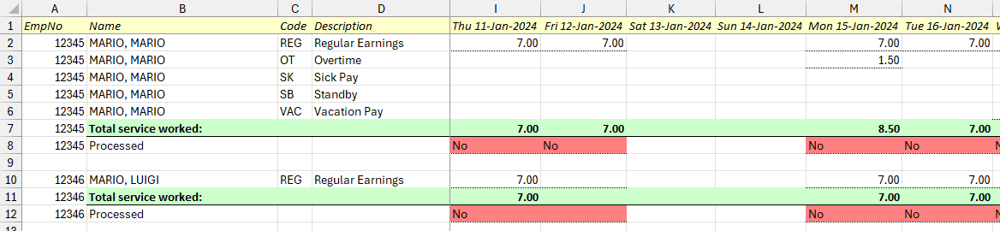

# node-avanti-time-data-parser

Parses the time data Excel report from Avanti into a JavaScript object.

Helpful when building an external process for supervisors to approve time entered
by time entry clerks.



## Installation

```sh
npm install @cityssm/avanti-time-data-parser
```

## Usage

```javascript
import { parseTimeData } from '@cityssm/avanti-time-data-parser'

const timeData = parseTimeData('timesheet.xlsx')

console.log(timeData)

/*
{
  "dateMin": "2024/01/07",
  "dateMax": "2024/01/20",
  "timeData": {
    "12345": {
      "employeeNumber": "12345",
      "employeeName": "MARIO, MARIO",
      "payCodes": {
        "REG": {
          "payCode": "REG",
          "payCodeDescription": "Regular Earnings",
          "hours": {
            "2024/01/08": 7,
            "2024/01/09": 5,
            "2024/01/10": 4,
            "2024/01/11": 7,
            "2024/01/12": 7,
            "2024/01/15": 8.5,
            "2024/01/16": 7,
            "2024/01/17": 4,
            "2024/01/18": 7,
            "2024/01/19": 7
          }
        },
        "SK": {
          ...
        },
        "SB": {
          ...
        },
        "VAC": {
          ...
        }
      }
    },
    "12346": {
      ...
    }
  },
  "approvedTimeData": {
    "12345": {
      ...
    },
    "12346": {
      ...
    }
  }
}
*/
```
